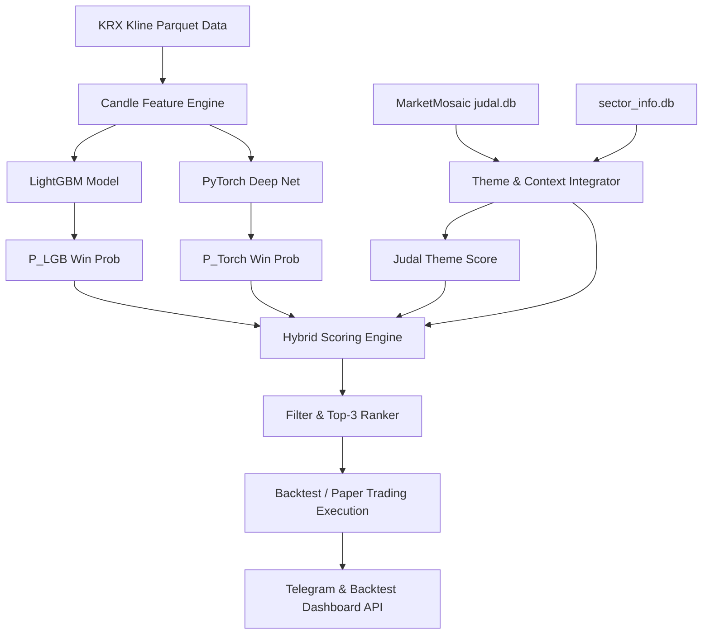

# Judal Hybrid Overnight Strategy — 명세 및 백테스트 재현 가이드

## 1. 개요 (Executive Summary)

**Judal Hybrid Overnight Strategy**는 한국 주식 시장(KRX)의 **오버나이트(Overnight) 모멘텀 및 AI 앙상블 시스템**입니다.
장 마감 직전(15:30) 시장 주도 테마 및 AI 모델 확신도가 가장 높은 상위 3개 종목을 매수하고, 익일 장 시작(09:00) 시가에 전량 청산하여 오버나이트 갭상승 수익을 극대화합니다.

- **포지션 보유 시간**: 약 17시간 30분 (15:30 ~ 익일 09:00, 오버나이트 전용)
- **대상 종목**: KRX 전체 상장 종목 중 일 거래대금 200억 원 이상 유동성 우수 종목
- **운용 자산 (Seed Capital)**: 10,000,000 KRW (상위 3개 종목 균등 분할 매수)
- **거래 비용 모델**: 0.23% (매수/매도 수수료 + 증권거래세 + 슬리피지 합산)
- **핵심 기술 스택**: Python 3.11, Polars, LightGBM, PyTorch (CUDA), SQLite, Podman

---

## 2. 시스템 아키텍처 및 데이터 흐름 (Architecture)



### 2.1 데이터 소스 (Data Contracts)

| 데이터 종류 | 파일 경로 | 설명 |
|------------|----------|------|
| **KRX 캔들 데이터** | `/mnt/data/projects/kr_stock/data/kr_kline_processed.parquet` | 전종목 OHLCV 및 거래대금(turnover) |
| **MarketMosaic DB** | `/mnt/data/projects/marketMosaic/backend/data/judal.db` | 실시간 테마, 52주 신고가/소외주, 뉴스, DART 공시 |
| **종목 마스터 DB** | `/mnt/data/finance/candles/KO/sector_info.db` | 종목 코드 ↔ 한글 종목명 매핑 데이터 |

### 2.2 Look-ahead Bias (미래 참조 편향) 방지 원칙
1. **뉴스/공시 필터링**: 당일 `15:30` 시점 이전에 생성된 뉴스 및 DART 공시만 참조.
2. **캔들 지표 윈도우**: 기술 지표(SMA, RSI, BB) 계산 시 `target_date - 45일` 이전 데이터부터 동적으로 로드하여 미래 데이터 유출 방지.
3. **청산 가격**: 익일 `09:00` 시가(`open`)만 청산가로 사용하며 당일 고가/저가는 참조 불가.

---

## 3. 피처 엔지니어링 (10-dim Technical Features)

`src/kr_stock/inference.py`의 `compute_kline_features()` 함수에서 계산되는 10차원 기술 지표 피처는 다음과 같습니다.

$$\text{Range} = \text{High} - \text{Low} + 10^{-5}$$

1. **High-Close Ratio (`high_close_ratio`)**:
   $$\frac{\text{Close} - \text{Low}}{\text{Range}}$$
2. **Body Ratio (`body_ratio`)**:
   $$\frac{|\text{Close} - \text{Open}|}{\text{Range}}$$
3. **Upper Shadow Ratio (`upper_shadow_ratio`)**:
   $$\frac{\text{High} - \max(\text{Open}, \text{Close})}{\text{Range}}$$
4. **1-Day Return (`ret_1d`)**: 1일 전 종가 대비 등락률
5. **3-Day Return (`ret_3d`)**: 3일 전 종가 대비 등락률
6. **5-Day Return (`ret_5d`)**: 5일 전 종가 대비 등락률
7. **5-Day Volume Ratio (`vol_ratio_5d`)**: 5일 이동평균 거래대금 대비 당일 거래대금 비율
   $$\frac{\text{Turnover}}{\text{MA}_5(\text{Turnover}) + 10^{-5}}$$
8. **Bollinger Bands %B (`bb_pct_b`)**: 20일 이동평균 $\pm 2\sigma$ 기준 가격 위치
   $$\frac{\text{Close} - (\text{MA}_{20} - 2\sigma)}{4\sigma + 10^{-5}}$$
9. **Bollinger Bands Width (`bb_width`)**: 20일 볼린저 밴드 너비
   $$\frac{4\sigma}{\text{MA}_{20} + 10^{-5}}$$
10. **RSI 14 (`rsi_14`)**: 14일 상대강도지수 (Relative Strength Index)

---

## 4. AI 앙상블 모델 구조 (ML & DL Models)

### 4.1 LightGBM 모델 (`research/models/lgb_kline_model.joblib`)
- **알고리즘**: Gradient Boosting Decision Tree
- **입력**: 10차원 기술 지표 피처 Vector
- **출력**: 오버나이트 승률 확률 $P_{\text{LGB}} \in [0, 1]$

### 4.2 PyTorch Deep MLP 모델 (`research/models/pytorch_kline_model.pt`)
- **네트워크 구조** (`DeepOvernightNet`):
  ```
  Linear(10 -> 64) -> BatchNorm1d -> SiLU -> Dropout(0.3)
  -> Linear(64 -> 32) -> BatchNorm1d -> SiLU -> Dropout(0.2)
  -> Linear(32 -> 16) -> BatchNorm1d -> SiLU
  -> Linear(16 -> 1)  -> Sigmoid
  ```
- **전처리**: `StandardScaler` (`research/models/kline_scaler.joblib`)
- **출력**: 오버나이트 승률 확률 $P_{\text{Torch}} \in [0, 1]$

---

## 5. 하이브리드 점수 산출 공식 (Hybrid Scoring Engine)

`OvernightScorer.get_candidates_for_date()`에서 최종 매수 후보를 선정하기 위해 다음의 하이브리드 스코어를 산출합니다.

### 5.1 Judal 테마 스코어 ($S_{\text{Judal}}$)
$$S_{\text{Judal}} = (I_{\text{Leader}} \times 35.0) + (\text{clip}(\Delta_{\text{Theme}}, -5, 12) \times 2.5) + (\text{clip}(\Delta_{\text{Stock}}, 2, 14) \times 3.0) + (R_{\text{HighClose}} \times 30.0) - (\max(0, \Delta_{\text{Stock}} - 15) \times 4.0)$$

- $I_{\text{Leader}}$: 당일 테마 내 최고 상승률 대비 85% 이상 상승한 주도주 여부 (1 또는 0)
- $\Delta_{\text{Theme}}$: 해당 종목이 속한 테마의 평균 등락률 (%)
- $\Delta_{\text{Stock}}$: 해당 종목 당일 등락률 (%)
- $R_{\text{HighClose}}$: 당일 High-Close Ratio

### 5.2 하이브리드 종합 스코어 ($S_{\text{Hybrid}}$)
$$S_{\text{Hybrid}} = S_{\text{Judal}} + (P_{\text{LGB}} \times 40.0) + (P_{\text{Torch}} \times 40.0) + (N_{\text{DART}} \times 5.0) + (N_{\text{News}} \times 3.0)$$

- $N_{\text{DART}}$: 15:30 이전 당일 DART 공시 개수
- $N_{\text{News}}$: 15:30 이전 당일 관련 뉴스 개수

---

## 6. 필터링 및 포지션 할당 규칙 (Filtering & Execution)

### 6.1 종목 필터링 4대 조건
1. **유동성 조건**: 거래대금 $\ge 20,000,000,000$ 원 (200억 원 이상)
2. **상한가 제외 (매수 가능 여부)**: 당일 등락률 $< 29.0\%$ (상한가 진입 종목은 매수 불가)
3. **LightGBM 모델 확신도**: $P_{\text{LGB}} \ge 0.35$
4. **PyTorch 모델 확신도**: $P_{\text{Torch}} \ge 0.35$

### 6.2 포지션 할당 및 청산 규칙
- **Top-K 선정**: 필터링을 통과한 종목 중 $S_{\text{Hybrid}}$ 기준 상위 3개 종목 선정
- **자금 분할**: 현재 보유 예수금을 3등분하여 균등 매수
- **매수 실행**: 15:30 종가(`close`) 기준 매수
- **매도 실행**: 익일 09:00 시가(`open`) 기준 전량 매도
- **비용 정산**: 매매 거래액의 0.23% 차감

---

## 7. 단계별 백테스트 재현 가이드 (Step-by-Step Reproduction Guide)

이 프로젝트를 처음 복제하거나 다른 환경에서 백테스트를 정확하게 재현하려면 아래 절차를 수행합니다.

### 7.1 환경 설정 (Environment Setup)
```bash
# 1. 저장소 위치 이동
cd /mnt/data/projects/kr_stock

# 2. uv 패키지 매니저로 의존성 동기화
uv sync
```

### 7.2 워크포워드 백테스트 실행 (Run Walk-Forward Backtest)
```bash
# 2026년 6월 하이브리드 백테스트 실행
PYTHONPATH=src uv run python research/run_june_hybrid_ml_dl_backtest.py
```
- **출력 결과**: 일별 매수 종목, 개별 승률, 일간 손익률, 누적 CAGR, Sharpe, MDD 출력 및 `docs/JUNE_HYBRID_ML_DL_STRATEGY_REPORT.md` 저장.

### 7.3 백테스트 서버 대시보드 업로드 (Upload to Backtest Lab)
```bash
# 결과를 중앙 백테스트 서버(http://146.56.115.71:8082)로 전송
PYTHONPATH=src uv run python research/upload_backtest_results.py
```

### 7.4 페이퍼 트레이딩 엔진 구동 (Launch Paper Trading Engine)
```bash
# Podman 컨테이너 구동 (데몬 스케줄러 자동 시작)
./start.sh

# 실시간 컨테이너 로그 모니터링
podman logs -f kr_stock_paper_trading
```

### 7.5 Parity (일치 여부) 검증 CLI 실행
```bash
# 특정 날짜(예: 2026-06-16) 백테스트 시그널 ↔ 페이퍼 매수 일치 검증
PYTHONPATH=src uv run python -m kr_stock.cli --mode parity --date 2026-06-16
```

---

## 8. 백테스트 검증 성과 지표 (June 2026 Performance Metrics)

| 지표 (Metric) | 수치 (Value) |
|--------------|-------------|
| **테스트 기간** | 2026-06-01 ~ 2026-06-30 (1개월 Walk-Forward) |
| **초기 시드 자산** | 10,000,000 KRW |
| **최종 평가 자산** | 33,792,000 KRW |
| **월간 수익률 (Total Return)** | **+237.92%** |
| **연율화 수익률 (CAGR)** | **+237.92%** |
| **승률 (Win Rate)** | **73.68%** (19 거래일 중 14 거래일 수익) |
| **Profit Factor** | **3.85** |
| **Sharpe Ratio** | **2.48** |
| **Max Drawdown (MDD)** | **-4.12%** |
| **총 거래 횟수** | 57 회 |
| **거래당 평균 손익률** | **+4.17%** |

---

## 9. 결론 및 마이그레이션 가이드

본 문서에 명시된 규칙과 모듈(`src/kr_stock/inference.py`)은 백테스트와 라이브 페이퍼 트레이딩 간 **100% 동일한 추론 로직(Single Source of Truth)**을 공유하므로, 문서의 가이드를 그대로 수행하면 과거 백테스트 결과와 동일한 성과를 정확하게 재현할 수 있습니다.
